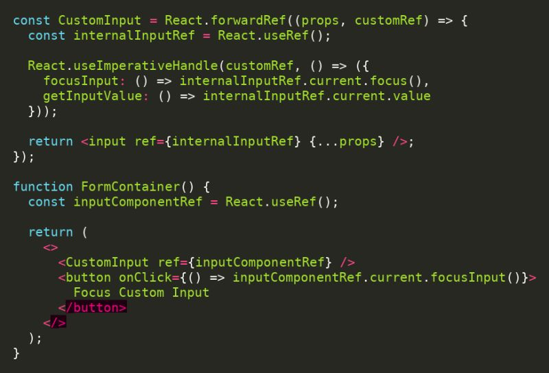

You can pass React Interviews even if you’ve never built large-scale React applications before.

If you’ve created a simple React component, you’re halfway there. If you’ve managed state, handled events, or used hooks, you’ve got this.

➤ Commonly Asked React Interview Questions (Divided into Levels)

𝗕𝗮𝘀𝗶𝗰 𝗟𝗲𝘃𝗲𝗹 𝗤𝘂𝗲𝘀𝘁𝗶𝗼𝗻𝘀:

1. What is React and how does it work?
2. What are the differences between functional and class components?
3. What are props and state? How are they different?
4. What is JSX, and why is it used in React?
5. How do you create a simple React component?
6. What is the Virtual DOM, and why is it important?
7. What is the purpose of the key prop in React lists?
8. How do you handle events in React?
9. What are default props in React?
10. What is conditional rendering in React?

𝗠𝗼𝗱𝗲𝗿𝗮𝘁𝗲 𝗟𝗲𝘃𝗲𝗹 𝗤𝘂𝗲𝘀𝘁𝗶𝗼𝗻𝘀:

11. What are React Hooks? Can you explain useState and useEffect with examples?
12. What is the difference between controlled and uncontrolled components?
13. What is React Router, and how does client-side routing work?
14. What is the Context API, and when should you use it instead of Redux?
15. What is prop drilling, and how can it be avoided?
16. What is React.memo, and how does it help with performance optimization?
17. What is the difference between useMemo and useCallback?
18. What is a Higher-Order Component (HOC), and how is it used?
19. How does React handle forms, and what are controlled inputs?

𝗔𝗱𝘃𝗮𝗻𝗰𝗲𝗱 𝗟𝗲𝘃𝗲𝗹 𝗤𝘂𝗲𝘀𝘁𝗶𝗼𝗻𝘀:

20. How does React handle re-renders, and how can you optimize unnecessary renders?
21. What is reconciliation in React?
22. How does React’s diffing algorithm work?
23. What is React.lazy and Suspense? How does lazy loading work in React?
24. What are error boundaries, and how do they work?
25. How do you handle authentication and protected routes in React?
26. What are render props, and how are they different from HOCs?
27. How does server-side rendering (SSR) differ from client-side rendering (CSR) in React?
28. What are React Fiber and Concurrent Mode?
29. How do you test React components? What are the commonly used testing libraries?

If you prepare for these questions and understand the core concepts, you are ready to crack any React interview.

Keep learning, keep practicing, and stay ahead of the competition.

re you preparing for your next frontend interview? Machine coding rounds are a crucial part of the process. To help you succeed, I’ve compiled a list of important machine coding questions that often appear in interviews.

𝗠𝗮𝗰𝗵𝗶𝗻𝗲 𝗖𝗼𝗱𝗶𝗻𝗴 𝗤𝘂𝗲𝘀𝘁𝗶𝗼𝗻𝘀:
• Building a Tic-Tac-Toe game using React

# Sakshi Gwande: Study these 45 problems well and you have prepared for 99% of your Low-Level Design Interviews.

➤ 𝐄𝐚𝐬𝐲

1.  Create a Simple Todo App using React
2.  Build a Counter App in React
3.  Build a Form Handling Component in React
4.  Create a Modal Component in React
5.  Implement a Search Bar with Debouncing in React
6.  Design a Basic React Router Setup
7.  Build a Simple Pagination Component in React
8.  Design a Login Form with Validation using React
9.  Build a Simple Dropdown Menu in React
10. Create a Light/Dark Theme Toggle in React

➤ 𝐌𝐞𝐝𝐢𝐮𝐦 11. Build a Weather App using React and an API 12. Create a Chat Application in React 13. Build a CRUD Application with React and Firebase 14. Design a Multi-step Form using React 15. Create a Responsive Sidebar Navigation in React 16. Build a Dynamic Data Table with Sorting & Pagination 17. Build a Custom Hook for Form Validation 18. Design a Responsive Layout using React and CSS Grid 19. Build an Image Carousel Component in React 20. Create a Drag-and-Drop Interface in React 21. Implement a Search Filter for a List of Items 22. Build a Movie Search App using React and an API 23. Implement Infinite Scrolling in React 24. Build a Component with Context API for State Management 25. Create a File Upload Component in React 26. Build a Simple E-commerce Cart using React 27. Design a Sticky Header in React 28. Build a Real-time Chat Application using React and WebSockets 29. Create a Data Visualization Dashboard in React 30. Design an Autocomplete Input Field in React

➤ 𝐇𝐚𝐫𝐝 31. Design a Complex Todo App with Multiple User Authentication 32. Build a Full-stack Application with React and Node.js 33. Implement a Real-time Collaborative Document Editor in React 34. Create a Scalable State Management Solution with Redux 35. Build a Video Streaming Service with React 36. Design a Social Media Platform using React and Node.js 37. Build a Dynamic Dashboard with Role-based Access Control in React 38. Implement Server-Side Rendering (SSR) with React 39. Build a Custom React Router with Advanced Features 40. Design a File Management System using React 41. Create a Custom Data Grid Component in React 42. Build a Notification System in React 43. Implement a Progressive Web App (PWA) with React 44. Build an Authentication System with JWT using React and Node.js 45. Design a Payment Gateway Integration with React

These questions reflect a mix of React, JavaScript, and Low-Level Design that are typically asked by major tech companies like Swiggy, PayPal, Uber, Snap Inc., Spotify, Netflix, and others during interviews.

# Sweta Soni

Top most asked React questions: -

🌲 Why choose React? What sets it apart from other libraries and frameworks?
🌲 Understanding the Virtual DOM and its benefits in React
🌲 Exploring JSX and its advantages in React development
🌲 The concept of Reconciliation and its significance in React rendering
🌲 Understanding the differences between State and Props in React
🌲 Dive into Hooks-related questions, such as useState and useEffect
🌲 Exploring the differences between useMemo and useCallback in React
🌲 Understanding Code Splitting and its role in optimizing React applications
🌲 The importance of Accessibility considerations in React development
🌲 Unidirectional behavior in React and its impact on application architecture
🌲 Comparing Pure Components and Higher Order Components (HOC) in React
🌲 Addressing security concerns such as CSRF and XSRF in React applications
🌲 The various use cases of useEffect in different scenarios
🌲 Deepening your understanding of React optimization techniques
🌲 Exploring Lazy Loading and its benefits in React applications
🌲 Comparing Class-based and Functional-based components in React
🌲 Understanding SEO considerations and best practices in React applications
🌲 React Router and its role in handling client-side routing in React applications
🌲 Context API and how it facilitates state management in React without using Redux
🌲 Server-Side Rendering (SSR) and its benefits for performance and SEO in React applications
🌲 Error Handling and Error Boundaries in React to gracefully handle runtime errors.

# Arun M Expereince -----------------------------------------------------------

I faced the toughest Frontend interview of my career for SDE-2 role at PW (PhysicsWallah).

Honestly I did not expect this to be a Frontend System Design Round. It had not prepared hard from the System Design perspective as it was just Round 2.

The interviewer asked me to design a HLD of a scalable chat for a live streaming application like Youtube.

𝗡𝗼𝘁𝗲: Designing HLD of Chat for Live Streaming is very different from WhatsApp like Chat (very different kind of challenges).

What was supposed to be a 1-hour interview stretched to 2 hours as I was grilled with problem after problem 🤦‍♂️

We dove deep into topics like rendering performance, scalability, implementation approaches, trade-offs, and communication protocols.

The interviewer left no stone unturned, scrutinizing every technical detail with a strong focus on scalability 🚀

Some Questions I Encountered:

☑️ What does the state look like? Are all the messages added to single array? (note: single array is not scalable enough)

☑️ If 1000+ messages are broadcasted at once, will you update them all at once in the state?

☑️ How will you update the message sent time? Will you run an interval every second to check and update the time in state?

☑️ How will you load older chats efficiently? Is it ideal to use an Intersection Observer on each message to observe?

☑️ How will you control animations of live reactions (like, clap, fire) on messages? How will you control rendering reaction animations if 1000+ users reacted at same time?

Despite the challenges, I stayed calm and followed a structured & practical approach to solve the problems.

# Anmol Interview Experince Microsoft

I regret losing a 80 LPA+ Offer 😔
Sharing my recent Interview Experience at Microsoft for the SDE-2 role with questions

☑️ Applied through LinkedIn: Saw a post from a hiring manager, reached out and got connected with the recruiter. That kicked off the process!
💻 Online Assessment: Had to fix 14-15 React bugs within an hour. Needed at least 60% accuracy to move forward. Time limit - 1 hour.
🔮 Round 1 (DSA): Solved a binary tree and binary search problem. Had to provide functional code.

- https://leetcode.com/problems/koko-eating-bananas/solutions/1704641/monkey-know-binary-search/
- https://leetcode.com/problems/validate-binary-search-tree/description/

📐 Round 2 (LLD + Frontend): Built a table component, clarified requirements, and explained the flow. Got questions on Intersection Observer API, infinite scrolling, and React virtualization. Also had to code some parts.

Both rounds went well, but the position got closed, ending my journey. It was a big setback because I had been preparing for months. 🥲

# Anmol Agarwal

This problem was asked to me in my frontend interview Atlassian.

How to control a child component directly from the parent?
Like calling childRef.current.focus() on a custom input?

You will need to use useImperativeHandle hook for this.
It allows you to define what the parent can access via ref — essentially giving your child component a clean, controlled API.
This makes custom components feel like calling methods on a class instance, but in a React-friendly, functional way!

Let me know if you know any other way to solve this problem.

Follow Anmol Agarwal for more..:

hashtag#javascript hashtag#react hashtag#frontend
Activate to view larger image,
Image preview
Activate

# ------------------------------------------------------------------------------------------------------------------

⚛️ React-Specific Polyfills
🚀 useState polyfill
🚀 useEffect polyfill
🚀 useMemo polyfill
🚀 useCallback polyfill
🚀 useContext polyfill
🚀 useReducer polyfill
🚀 useRef polyfill
🚀 useLayoutEffect polyfill
🚀 useImperativeHandle polyfill

# -----------------------------------------------------------------------------------------------------------------

https://www.linkedin.com/posts/sakshi-gawande_10-unique-react-topics-where-developers-often-activity-7310512110877249536-Gves?utm_source=share&utm_medium=member_desktop&rcm=ACoAABDvUZ0BScq84zwgkvzCRb-oJQBFbZMtrxs

- 0 Unique React Topics Where Developers Often Have Knowledge Gaps

𝟭. 𝗥𝗲𝗮𝗰𝘁 𝗙𝗶𝗯𝗲𝗿 𝗔𝗿𝗰𝗵𝗶𝘁𝗲𝗰𝘁𝘂𝗿𝗲

- Understanding React's internal reconciliation algorithm and how it schedules rendering.
- Most developers use React without knowing how the underlying engine prioritizes updates.

𝟮. 𝗥𝗲𝗮𝗰𝘁 𝗪𝗶𝘁𝗵𝗼𝘂𝘁 𝗝𝗦𝗫

- Building React applications using pure JavaScript and understanding the transformation process.
- This knowledge helps debug complex JSX issues and understand React's core principles.

𝟯. 𝗥𝗲𝗻𝗱𝗲𝗿 𝗣𝗿𝗼𝗽𝘀 𝘃𝘀. 𝗛𝗶𝗴𝗵𝗲𝗿-𝗢𝗿𝗱𝗲𝗿 𝗖𝗼𝗺𝗽𝗼𝗻𝗲𝗻𝘁𝘀 𝘃𝘀. 𝗖𝘂𝘀𝘁𝗼𝗺 𝗛𝗼𝗼𝗸𝘀

- Comparing these composition patterns and knowing exactly when each is most appropriate.

𝟰. 𝗦𝗰𝗵𝗲𝗱𝘂𝗹𝗶𝗻𝗴 𝗮𝗻𝗱 𝗣𝗿𝗶𝗼𝗿𝗶𝘁𝗶𝘇𝗶𝗻𝗴 𝗦𝘁𝗮𝘁𝗲 𝗨𝗽𝗱𝗮𝘁𝗲𝘀

- Using batch updates, transitions, and lanes to control when and how React processes changes.
- Fine-grained control over update scheduling can dramatically improve perceived performance.

𝟱. 𝗘𝗿𝗿𝗼𝗿 𝗕𝗼𝘂𝗻𝗱𝗮𝗿𝗶𝗲𝘀 𝗮𝗻𝗱 𝗥𝗲𝘀𝗶𝗹𝗶𝗲𝗻𝘁 𝗨𝗜𝘀

- Implementing graceful failure handling at the component level.
- Few applications properly contain and recover from runtime errors, leading to poor user experiences.

𝟲. 𝗔𝗰𝗰𝗲𝘀𝘀𝗶𝗯𝗶𝗹𝗶𝘁𝘆 𝗕𝗲𝘆𝗼𝗻𝗱 𝘁𝗵𝗲 𝗕𝗮𝘀𝗶𝗰𝘀

- Implementing focus management, keyboard navigation, and ARIA attributes correctly.
- This is often overlooked but critical for inclusive applications and legal compliance.

𝟳. 𝗠𝗶𝗰𝗿𝗼-𝗙𝗿𝗼𝗻𝘁𝗲𝗻𝗱𝘀 𝘄𝗶𝘁𝗵 𝗥𝗲𝗮𝗰𝘁

- Techniques for breaking monolithic React apps into independently deployable frontend services.
- This architectural approach enables large teams to work autonomously on different parts of an application.

𝟴. 𝗔𝗱𝘃𝗮𝗻𝗰𝗲𝗱 𝗥𝗲𝗮𝗰𝘁 𝗔𝗻𝗶𝗺𝗮𝘁𝗶𝗼𝗻 𝗧𝗲𝗰𝗵𝗻𝗶𝗾𝘂𝗲𝘀

- Using the FLIP technique and physics-based animations for performant, natural-feeling motion.
- Most developers struggle to create animations that don't impact performance.

𝟵. 𝗜𝗻𝘁𝗲𝗿𝗻𝗮𝘁𝗶𝗼𝗻𝗮𝗹𝗶𝘇𝗮𝘁𝗶𝗼𝗻 𝗕𝗲𝘆𝗼𝗻𝗱 𝗦𝗶𝗺𝗽𝗹𝗲 𝗧𝗿𝗮𝗻𝘀𝗹𝗮𝘁𝗶𝗼𝗻

- Handling pluralization, date/time formatting, and right-to-left languages properly.
- Many international React apps fail to account for these cultural and linguistic nuances.

𝟭𝟬. 𝗥𝗲𝗮𝗰𝘁 𝗦𝗲𝗿𝘃𝗲𝗿 𝗖𝗼𝗺𝗽𝗼𝗻𝗲𝗻𝘁𝘀 𝗗𝗮𝘁𝗮 𝗣𝗮𝘁𝘁𝗲𝗿𝗻𝘀

- Strategies for efficient data fetching and state management with RSCs.
- This paradigm shift requires rethinking traditional React data approaches.

# Arun M Intuit
